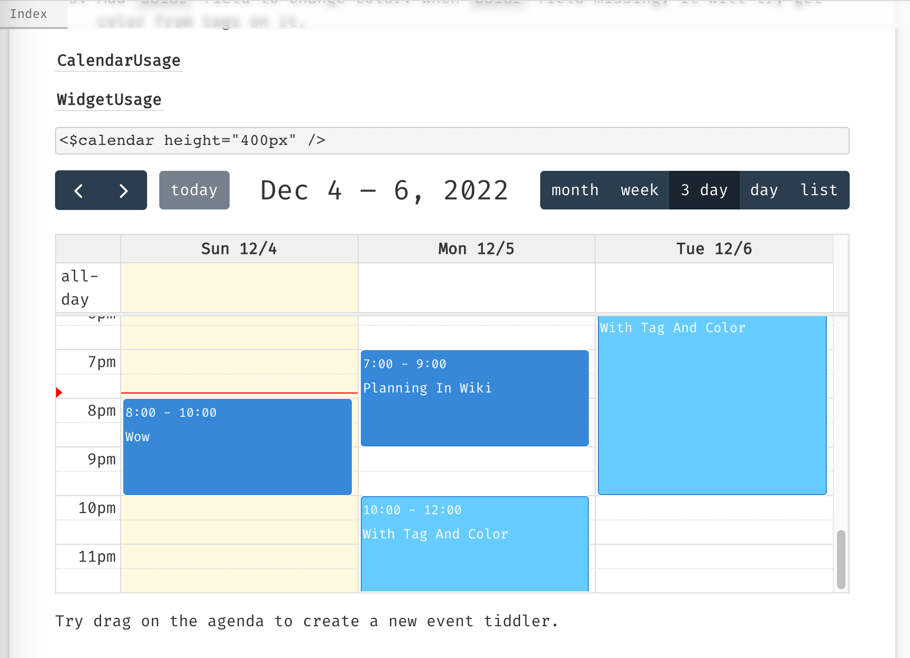
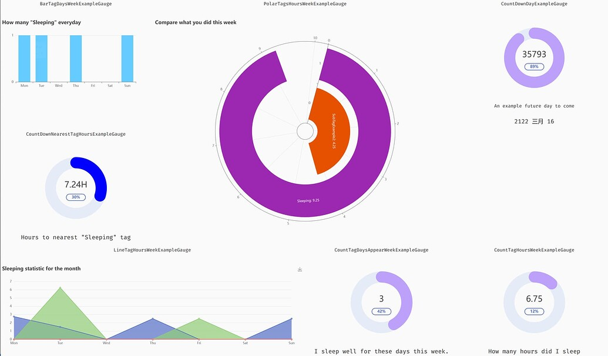

# TiddlyWiki Calendar

Widget and Page Layout displaying tiddlers on calendar and agenda, based on created, modified, startDate and endDate fields.

See also [More layouts in Tiddlywiki (ZH-cn)](https://zhuanlan.zhihu.com/p/601040724)

## Document & Usage

See website [https://tiddly-gittly.github.io/tiddlywiki-calendar](https://tiddly-gittly.github.io/tiddlywiki-calendar) for demo and usage

## Credits

This project is based on [FullCalendar](https://github.com/fullcalendar/fullcalendar), best open source calendar library available.

## Development

There are some scripts you can run to boost your development.

After `npm i --legacy-peer-deps`:

- `npm run dev` to pack the plugin in the `dist/` directory, this will setup a site that will auto reload when you have changes. But this is development mode, will produce a much larget bundle than the final version, so only for dev.
- `npm run dev-html` to setup the demo site locally. Re-run this command and refresh browser to see changes. In this way you can see the real bundle size same as your user will get.

You will need `--legacy-peer-deps` when `npm i` if you are using latest nodejs. This is a bug in npm.

### Add a second ts file

Add new file name (without `.ts`) to `package.json`'s `tsFiles` field. And build script will read it and compile files in it.

### After the plugin is complete

#### Publish

Enable github action in your repo (in your github repo - setting - action - general) if it is not allowed, and when you tagging a new version `vx.x.x` in a git commit and push, it will automatically publish to the github release.
